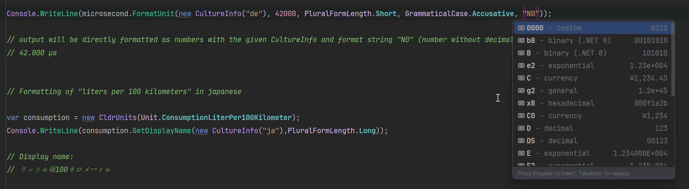

# Unit CLDR Data for C#

[](https://github.com/Machibuse/Porticle.CLDR/actions/workflows/release.yaml)  

This library allows you to format units with numeric values, such as `1 byte` or `42 bytes`, ensuring the correct grammatical forms using CLDR data.

## Features

- **Fully Functional Out of the Box**  
  No additional CLDR data download is required; everything is included in the package.

- **Embedded CLDR Data**  
  The latest version of CLDR unit data is included as compressed embedded resources within the library.  

- **Optimized Compression**  
  Each unit has its own compressed resource — for example, separate ones for kilograms, days, weeks, months, and years.

- **Efficient Decompression**  
  Only the required units are decompressed when needed, while all others remain in embedded resources to avoid unnecessary memory usage.

## Missing features

- **Units Prefix Patterns**  
  CLDR Units contains information about Prefix Patterns like `kilo{0}` or `milli{0}`. This information is not yet implemented in this library.  

- **Few and Many Patterns for Units formatting**  
  CLDR Units contains information for formatting "few" and "many" patterns for some languages like "ru", "ar", "pl" and some more. This is not yet implemented in this library.

- **CompoundUnitPattern**
    CLDR Units contains information for formatting things like "power2" or "power3" into "square {0}" or "cubic {0}" for long and "{0}²" or "{0}³". 
    This is not yet implemented in this library.

- **DurationUnitPattern**
  CLDR Units contains information for formatting duration in hours, minutes and seconds. This is not yet implemented in this library.

- **DurationUnitPattern**
  CLDR Units contains information for formatting per unit patterns.
  This is used for formatting things like `Motel price is 40$/Night` for short and `Motel price is 40$ per night` for long format.
  This is only partially implemented in this library.


## Versioning

I will always try to ensure that the Major and Minor version of this library corresponds to the version of the CLDR library.
The Patch version will be used for bug fixes and minor improvements.
So the version `46.1.x` corresponds to the CLDR version `46.1`.

## Frameworks

- **.NET Standard 2.0**  
  This library is compatible with .NET Standard 2.0 and later.
- **.NET8**  
  This library is compatible with .NET8 and later.

Currently, the only difference between the two versions is the use of the `StringSyntax` attribute in .NET8.
This will show context help when using a specific number format.




## Getting Started

**Porticle.CLDR.Units** is available via the **NuGet** package manager. You can find the package here: [NuGet - Porticle.CLDR.Units](https://www.nuget.org/packages/Porticle.CLDR.Units/).

State on nuget.org [](https://www.nuget.org/packages/Porticle.CLDR.Units/)   [](https://www.nuget.org/packages/Porticle.CLDR.Units/)  

To install **Porticle.CLDR.Units** manually, use the following command in the Package Manager Console:

```
Install-Package Porticle.CLDR.Units
```

## Support

If you find this project useful and would like to support its development, consider buying me a coffee. Your support helps me keep improving and maintaining this library. Thank you! ☕  

[](https://buymeacoffee.com/CarstenJendro)

Bugs and feature requests are also welcome.

# Example

```csharp
using System.Globalization;
using Porticle.CLDR.Units;

var speed = new CldrUnits(Unit.SpeedKilometerPerHour);

Console.WriteLine(speed.GetFormatString(new CultureInfo("en-GB"), 0, PluralFormLength.Long, GrammaticalCase.Accusative));
Console.WriteLine(speed.GetFormatString(new CultureInfo("en-GB"), 1, PluralFormLength.Long, GrammaticalCase.Accusative));
Console.WriteLine(speed.GetFormatString(new CultureInfo("en-GB"), 2, PluralFormLength.Long, GrammaticalCase.Accusative));

// Output will be format strings only:
// {0} kilometres per hour
// {0} kilometre per hour
// {0} kilometres per hour

var microsecond = new CldrUnits(Unit.DurationMicrosecond);
Console.WriteLine(microsecond.FormatUnit(new CultureInfo("de"), 1, PluralFormLength.Long, GrammaticalCase.Accusative));
Console.WriteLine(microsecond.FormatUnit(new CultureInfo("de"), 42, PluralFormLength.Long, GrammaticalCase.Accusative));
Console.WriteLine(microsecond.FormatUnit(new CultureInfo("de"), 42000, PluralFormLength.Short, GrammaticalCase.Accusative));

// Output will be directly formatted as numbers with the given CultureInfo:
// 1 Mikrosekunde
// 42 Mikrosekunden
// 42000 µs

Console.WriteLine(microsecond.FormatUnit(new CultureInfo("de"), 42000, PluralFormLength.Short, GrammaticalCase.Accusative, "N0"));

// output will be directly formatted as numbers with the given CultureInfo and format string "N0" (number without decimal places but with thousands separator):
// 42.000 µs


// Formatting of "liters per 100 kilometers" in japanese
var consumption = new CldrUnits(Unit.ConsumptionLiterPer100Kilometer);
Console.WriteLine(consumption.GetDisplayName(new CultureInfo("ja"),PluralFormLength.Long));

// Display name:
// リットル毎100キロメートル

Console.WriteLine(consumption.FormatUnit(new CultureInfo("ja"), 42, PluralFormLength.Long, GrammaticalCase.Oblique));
Console.WriteLine(consumption.FormatUnit(new CultureInfo("ja"), 42, PluralFormLength.Short, GrammaticalCase.Oblique));

// output will be directly formatted as numbers with the given CultureInfo:
// 42 リットル毎100キロメートル
// 42 L/100km
```
